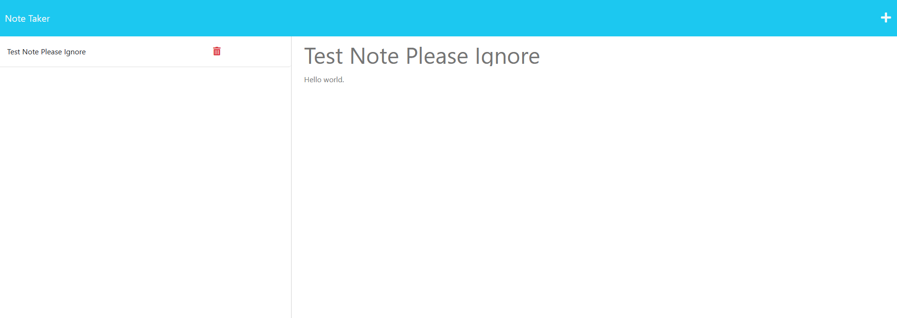

# Note Taker

## Table of Contents
  
* [Description](#description)
* [Usage](#usage)
* [Questions](#questions)

## Description

This is a node.js application using express.js in the back end that loads a note taking page client-side. This page allows a user to store notes on the server in a  json file and access them from anywhere. The user can also delete notes.

## Usage

Visit the page at the deployed link below. After selecting "Get Started," you will be routed to the notes page where you can type a Note Title and Note Text into the fields thus labeled. When content is present, a save icon will appear in the top right corner that can be clicked to send the note to the server and store it. It will then appear in the left, along with any prior notes, which can be viewed in full on the right by clicking its text, or deleted by clicking the trash icon. Deleting will remove the note from the server as well.

Deployed Link: <a href="https://jhnotetaker.herokuapp.com">https://jhnotetaker.herokuapp.com</a>

## Questions

Contact with questions/comments:
* GitHub: [hornickjohn](https://github.com/hornickjohn)
* Email: jhornick@live.com
    
